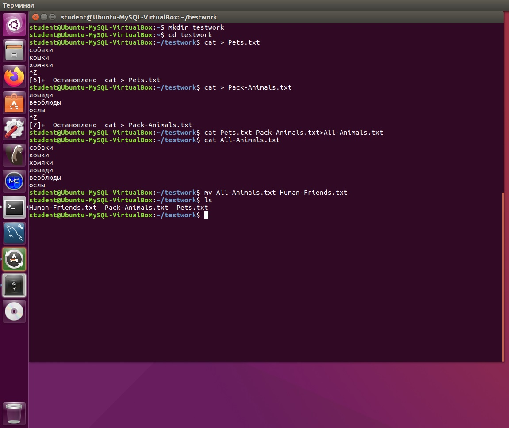
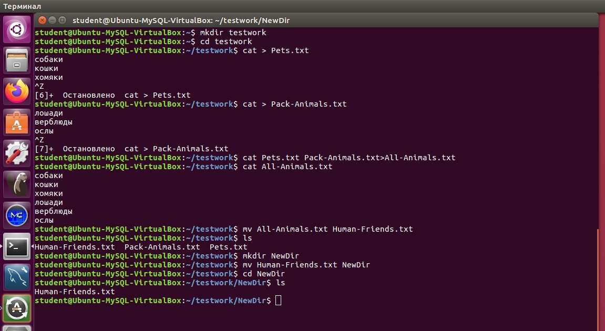
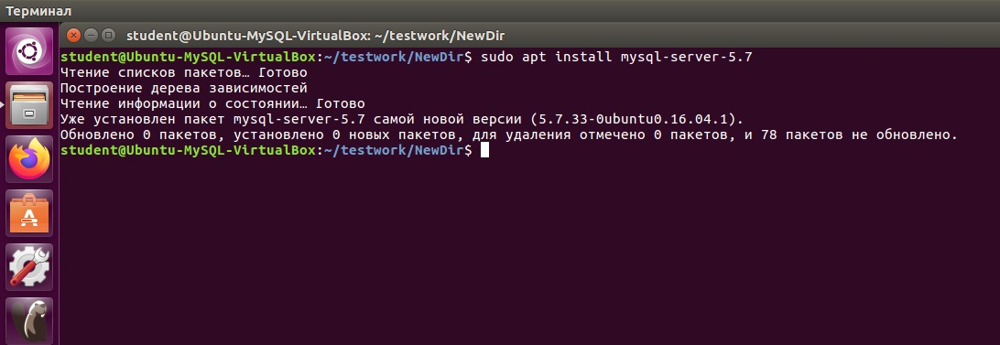
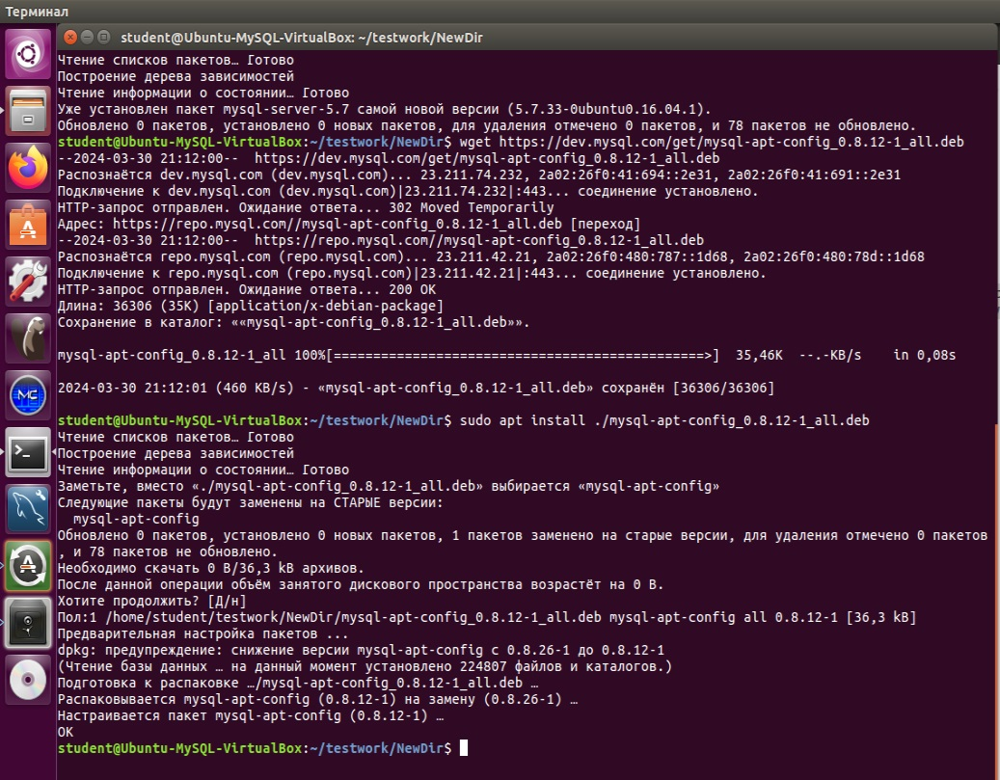
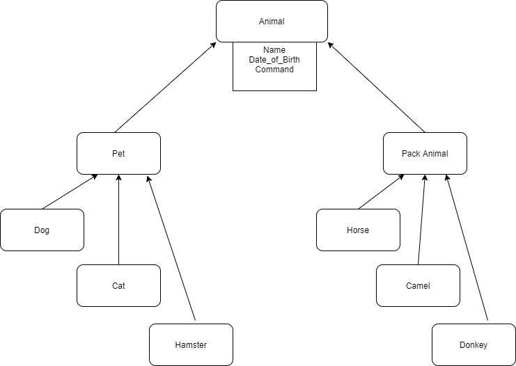

Операционные системы и виртуализация (Linux)

1. Использование команды cat в Linux
   - Создать два текстовых файла: "Pets"(Домашние животные) и "Packanimals"(вьючные животные), используя команду `cat` в терминале Linux. В первом файле перечислитьсобак, кошек и хомяков. Во втором — лошадей, верблюдов и ослов.
   - Объединить содержимое этих двух файлов в один и просмотреть его содержимое.
   - Переименовать получившийся файл в "HumanFriends"(.
Пример конечного вывода после команды “ls”:
Desktop Documents Downloads  HumanFriends.txt  Music  PackAnimals.txt  Pets.txt  Pictures  Videos

2. Работа с директориями в Linux
   - Создать новую директорию и переместить туда файл "HumanFriends".

3. Работа с MySQL в Linux. “Установить MySQL на вашу вычислительную машину ”
   - Подключить дополнительный репозиторийMySQL и установить один из пакетов из этого репозитория.

4. Управление deb-пакетами
   - Установить и затем удалить deb-пакет, используя команду `dpkg`.

5. История команд в терминале Ubuntu
   - Сохранить и выложить историю ваших терминальных команд в Ubuntu.
В формате: Файлас ФИО, датой сдачи, номером группы(или потока)

Объектно-ориентированное программирование 

6. Диаграмма классов
   - Создать диаграмму классов с родительским классом "Животные", и двумя подклассами: "Pets" и "Packanimals".
В составы классов которых в случае Petsвойдут классы: собаки, кошки, хомяки, а в класс Packanimals войдут: Лошади, верблюды и ослы).
Каждый тип животных будет характеризоваться (например, имена, даты рождения, выполняемые команды и т.д)
Диаграмму можно нарисовать в любом редакторе, такими как Lucidchart, Draw.io, MicrosoftVisio и других.

7. Работа с MySQL(Задача выполняется в случае успешного выполнения задачи “Работа с MySQL в Linux. “Установить MySQL на вашу машину”

7.1. После создания диаграммы классов в 6 пункте, в 7 пункте база данных "HumanFriends" должна быть структурирована в соответствии с этой диаграммой. Например, можно создать таблицы, которые будут соответствовать классам "Pets" и "Packanimals", и в этих таблицах будут поля, которые характеризуют каждый тип животных (например, имена, даты рождения, выполняемые команды и т.д.).
7.2   - В ранее подключенном MySQL создать базу данных с названием "HumanFriends".
   - Создать таблицы, соответствующие иерархии из вашей диаграммы классов.
   - Заполнить таблицы данными о животных, их командах и датами рождения.
   - Удалить записи о верблюдах и объединить таблицы лошадей и ослов.
   - Создать новую таблицу для животных в возрасте от 1 до 3 лет и вычислить их возраст с точностью до месяца.
   - Объединить все созданные таблицы в одну, сохраняя информацию о принадлежности к исходным таблицам.

8. ООП и Java
   - Создать иерархию классов в Java, который будет повторять диаграмму классов созданную в задаче 6(Диаграмма классов) .

9. Программа-реестр домашних животных
    - Написать программу на Java, которая будет имитировать реестр домашних животных.
Должен быть реализован следующий функционал:

9.1. Добавление нового животного
        - Реализовать функциональность для добавления новых животных в реестр.
Животное должно определяться в правильный класс (например, "собака", "кошка", "хомяк" и т.д.)

9.2. Список команд животного
        - Вывести список команд, которые может выполнять добавленное животное (например, "сидеть", "лежать").

9.3. Обучение новым командам
        - Добавить возможность обучать животных новым командам.
  9.4Вывести список животных по дате рождения

9.5. Навигация по меню
        - Реализовать консольный пользовательский интерфейс с меню для навигации между вышеуказанными функциями.

10. Счетчик животных
Создать механизм, который позволяет вывести на экран общее количество созданных животных любого типа (Как домашних, так и вьючных), то есть при создании каждого нового животного счетчик увеличивается на “1”. 

8-10 Ссылка 